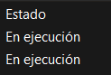
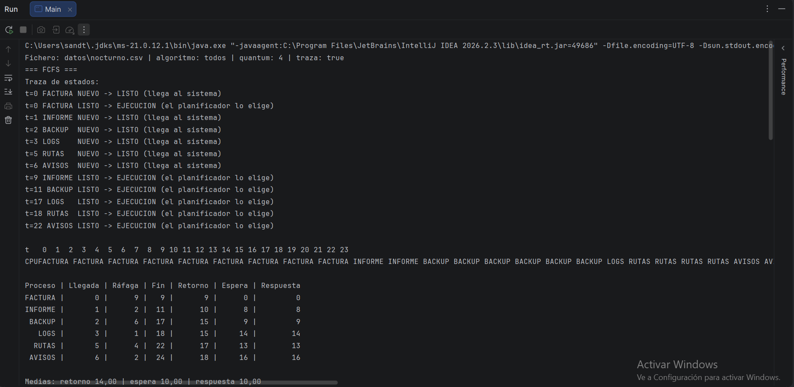

# Simulador de Planificación de Procesos - NexoData

## 1. Qué hace el proyecto
Este proyecto es un simulador en Java desarrollado para NexoData que reproduce el comportamiento de un planificador de CPU a corto plazo[cite: 4]. Lee una lista de trabajos por lotes desde un fichero `.csv` y simula su ejecución utilizando tres políticas de planificación distintas: FCFS, SJF (sin desalojo) y Round Robin (con quantum configurable)[cite: 4]. El sistema genera diagramas de Gantt, trazas de estados y calcula métricas clave (tiempo de espera, retorno, respuesta y cambios de contexto) para analizar el rendimiento de cada algoritmo[cite: 4, 8].

## 2. Cómo compilarlo y ejecutarlo
**Desde IntelliJ IDEA:**
1. Abre el proyecto y ve al menú superior de configuración de ejecución (`Edit Configurations...`).
2. En la casilla **Program arguments** introduce el comando siguiendo este formato: `datos/nocturno.csv todos 4 --traza`[cite: 5].
3. Asegúrate de que el **Working directory** apunta a la carpeta raíz del proyecto (`planificador-nexodata`)[cite: 5].
4. Ejecuta con el botón de *Play* verde.

**Desde la terminal:**
Sitúate en la raíz del proyecto y ejecuta los siguientes comandos para compilar en la carpeta `out` y lanzar el programa:
```bash
javac -d out src/planificador/*.java
java -cp out planificador.Main datos/nocturno.csv todos 4 --traza datos/nocturno.csv todos 4 --traza
```

## 3. Diseño y arquitectura
El diseño se basa en la reutilización de código para evitar duplicar el bucle de simulación[cite: 8]:
* **`Proceso` y `EstadoProceso`**: Componen el modelo de datos. Guardan los tiempos, la ráfaga restante y el estado actual del proceso[cite: 7].
* **`LectorCSV`**: Se encarga exclusivamente de parsear el archivo, omitiendo comentarios y líneas vacías, y validando los datos[cite: 7].
* **`AlgoritmoPlanificacion` (Clase Abstracta)**: Es el motor central. Contiene el bucle `while` que hace avanzar el reloj, gestiona las llegadas a la cola de listos, expulsa procesos terminados, registra el diagrama de Gantt y calcula las métricas finales[cite: 8].
* **`FCFS`, `SJF`, `RR` (Clases Hijas)**: Heredan el motor de simulación y únicamente implementan el método abstracto `elegirProceso()` (y `debeDesalojar()` en el caso de RR) dictando las reglas específicas de cada política[cite: 8].

## 4. Verificación


Al comparar mi resolución manual de `verificacion.csv` con la salida del programa, ambas coinciden en el orden de ejecución y en las métricas, confirmando que las reglas de empates y llegadas simultáneas se aplican correctamente[cite: 6, 9].

**Análisis del caso límite `hueco.csv`:**
Entre los instantes 2 y 5, la CPU se queda ociosa. El proceso X completa su ráfaga en el instante 2 y sale del sistema. Como el siguiente proceso no llega hasta el instante 5, la cola de listos está vacía durante 3 instantes[cite: 6, 9]. El diagrama de Gantt del simulador refleja este hueco correctamente imprimiendo guiones (`-`) durante esos instantes del reloj, demostrando que el tiempo avanza aunque la CPU no tenga trabajo[cite: 8, 9].

## 5. Análisis y recomendación a NexoData

| Algoritmo | Espera Media | Respuesta Media | Retorno Medio | Cambios Contexto |
| :--- | :--- | :--- | :--- | :--- |
| FCFS | 10,00 | 10,00 | 14,00 | 5 |
| SJF | 7,67 | 7,67 | 11,67 | 5 |
| RR (q=1) | 12,83 | 2,17 | 16,83 | 21 |
| RR (q=2) | 11,50 | 3,83 | 15,50 | 13 |
| RR (q=4) | 10,50 | 6,17 | 14,50 | 8 |

**Respuestas analíticas:**
1. **Menor espera media:** El algoritmo SJF ofrece la menor espera media (7,67) porque despacha rápidamente los trabajos cortos, evitando que un gran número de procesos se acumule en la cola de listos sumando tiempo de espera simultáneamente[cite: 9, 10].
2. **Caso LOGS en FCFS:** El proceso LOGS espera 14 minutos en FCFS pese a necesitar solo 1 minuto de CPU[cite: 9, 10]. Esto se denomina "efecto convoy", provocado por el proceso FACTURA, que monopoliza la CPU con su larga ráfaga de 9 minutos impidiendo el paso a los procesos más ligeros[cite: 9, 10].
3. **Problema de SJF:** El proceso más perjudicado en SJF es BACKUP. Si NexoData inyectara continuamente trabajos cortos cada pocos minutos, BACKUP sería constantemente relegado al final de la cola y nunca se ejecutaría[cite: 9, 10]. Este problema se llama *inanición* (starvation) y se soluciona con el *envejecimiento* (aging), aumentando gradualmente la prioridad de los procesos estancados[cite: 10].
4. **Quantum en Round Robin:** Al bajar el quantum de 4 a 1, el tiempo de respuesta medio mejora drásticamente (de 6,17 a 2,17), pero los cambios de contexto se disparan masivamente (de 8 a 21)[cite: 9, 10]. En un Sistema Operativo real, un quantum de 1 minuto sería inviable porque el *overhead* (el tiempo desperdiciado por la CPU en guardar y cargar el contexto de los procesos) acabaría consumiendo más recursos que la propia ejecución de las tareas[cite: 10].
5. **Comparativa RR (q=4) vs FCFS:** La espera media de RR (10,50) resulta peor que la de FCFS (10,00). Esto ocurre porque RR obliga a fraccionar la ejecución, provocando que todos los procesos avancen a la vez pero terminen más tarde que si se hubieran ejecutado de forma secuencial completa[cite: 9, 10].
6. **Estados del SO:** El simulador no utiliza el estado Bloqueado porque solo modela el uso de la CPU. En la realidad, un proceso pasa a Bloqueado cuando necesita realizar una operación de Entrada/Salida (I/O), como escribir en disco o esperar red, cediendo la CPU voluntariamente hasta que el recurso responda[cite: 10]. 



**Recomendación final para NexoData:**
Para la ejecución nocturna de estos trabajos por lotes, la recomendación técnica es utilizar el algoritmo **SJF (Shortest Job First)**[cite: 4, 10]. Dado que son procesos automáticos (sin usuarios humanos esperando respuesta inmediata en pantalla), priorizamos vaciar la carga del servidor rápidamente y obtener la menor espera media global[cite: 10]. Si el servidor albergara usuarios interactivos durante el día, la recomendación cambiaría a Round Robin para garantizar que ninguna sesión quede "congelada" por el efecto convoy de los trabajos largos[cite: 10].

## 6. Capturas de ejecución

